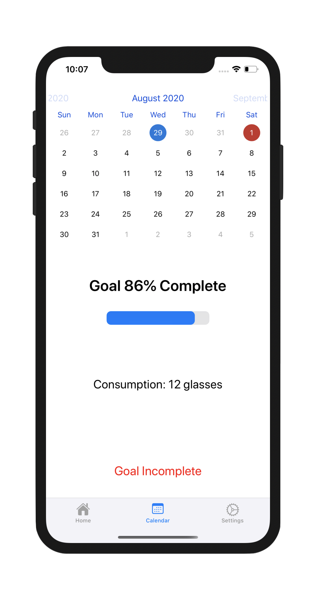

# Hydrate App (iOS)

Hydrate is a simple app that helps you track your water consumption per day. The water consumption is measured by cups, and the consumption goal everyday is customizable. The goal completion and consumption history can also be seen in a calendar view.

Watch the demo video:    
    
[Link to YouTube Video](https://youtu.be/Axu7xvnobP8)

## Purpose 
The purpose of this app is to provide a way of manually keeping track of your daily water consumption with a simple user interface that can be used by anyone. 

## Key Features
- Secure authentication
- Set daily goals for water consumption
- Opt in for daily reminders in the form of a notification to remember to complete your goal
- View your consumption and goal completion history using a calendar to select the dates 

## Technologies used
The app uses Firebase and Firestore for authentication and data storage. [CLTypingLabel](https://cocoapods.org/pods/CLTypingLabel) is used in the login screen, to give the text a typing animation when the view loads up. [FSCalendar](https://cocoapods.org/pods/FSCalendar) is used for the calendar view on the calendar tab, which lets the user select a certain date and view the stats for the selected date.

## App Screenshots 

  
   
  
  
  
  

